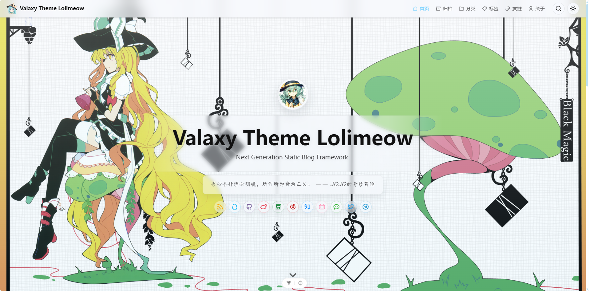

<h1 align="center">valaxy-theme-lolimeow</h1>

<pre align="center">A soft anime-style Valaxy theme for a calm daily writing space.</pre>

<p align="center">
  
</p>

<div align="center">
<table>
<tbody>
<tr>
<td align="center">
  <br>
  <span><b>English | <a href="./README.zh-CN.md">简体中文</a></b></span><br>
  <sub>Light anime atmosphere, soft reading surfaces, built-in Hitokoto motto, local search, and themed aggregate pages.</sub><br>
  <sub><a href="https://lolimeow.yoyo514.top/">Live Demo</a> · <a href="https://lolimeow.yoyo514.top/docs/">Documentation</a></sub><br>
  
</td>
</tr>
</tbody>
</table>
</div>

## Quick Start

If this is your first Valaxy site, read the [Valaxy getting started guide](https://valaxy.site/guide/getting-started) first.

```bash
pnpm add valaxy-theme-lolimeow
```

```ts
import { defineValaxyConfig } from 'valaxy'

export default defineValaxyConfig({
  theme: 'lolimeow',
  themeConfig: {
    ui: {
      primary: '#66CCFF',
    },
  },
})
```

## Theme Highlights

### Layered Anime Atmosphere

- Separate global and hero background pipelines for static images, image pools, and random image APIs.
- Image preload and decode handling for smoother background transitions.
- Soft shared reading planes that let illustrations stay visible behind posts, cards, footer, and aggregate pages.

### Hero Motto Scene

- Typewriter motto animation for fixed text, rotating local text, or the built-in Hitokoto API mode.
- Optional Hitokoto source suffix rendered as `sentence —— source`, with configurable sentence types and length filters.
- Hero cover, author identity, social links, and scroll hint are composed as one landing scene.

### Gentle Reading Interactions

- Auto-hide navbar with scroll-lock coordination for anchor jumps and pagination changes.
- Uneven or classic mobile drawer styles.
- Paw-like helper and mobile TOC placement for thumb-friendly reading on illustration-backed pages.

### Local Search Modal

- Fuse search based on Valaxy generated local search data.
- Debounced input, keyboard navigation, and theme-styled loading / empty / error states.
- Search modal uses the same soft surface language as drawers, cards, and reading panels.

### Aggregate Pages With Their Own Shape

- Archive timeline rail with responsive accordion behavior.
- Click-to-expand category tree for nested browsing.
- Capsule-style tag cloud with click-to-filter article results.
- Friend-link cards with Markdown preface, optional comments, and avatar-corner status hints.

### Themed Reading And Comments

- Cover and non-cover article headers share the same rhythm.
- Markdown styles are tuned for translucent reading surfaces, including code blocks, tables, media, footnotes, containers, and Mermaid examples.
- Waline comments are restyled with the theme surface tokens.

## Documentation

The README only keeps the minimal setup and overview. For full usage and module-based configuration, see the [Documentation](https://lolimeow.yoyo514.top/docs/).

Useful references for development:

- [theme/types/config.d.ts](./theme/types/config.d.ts) for the exported theme configuration structure.
- [theme/node/config.ts](./theme/node/config.ts) for default values and fallback behavior.
- [demo/valaxy.config.ts](./demo/valaxy.config.ts) for the demo configuration.

## Addons

| Addon                                                     | Usage        |
| --------------------------------------------------------- | ------------ |
| [valaxy-addon-waline](https://github.com/walinejs/waline) | Comment area |

## Development

```bash
pnpm install
pnpm dev
```

```bash
pnpm demo
pnpm build
pnpm lint
pnpm typecheck
```

## Acknowledgements

- [Valaxy](https://github.com/YunYouJun/valaxy)
- [Hitokoto](https://hitokoto.cn/)
- [Waline](https://github.com/walinejs/waline)

## License

[MIT License](./LICENSE) © Yoyo514
