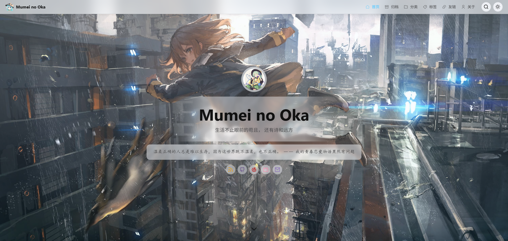
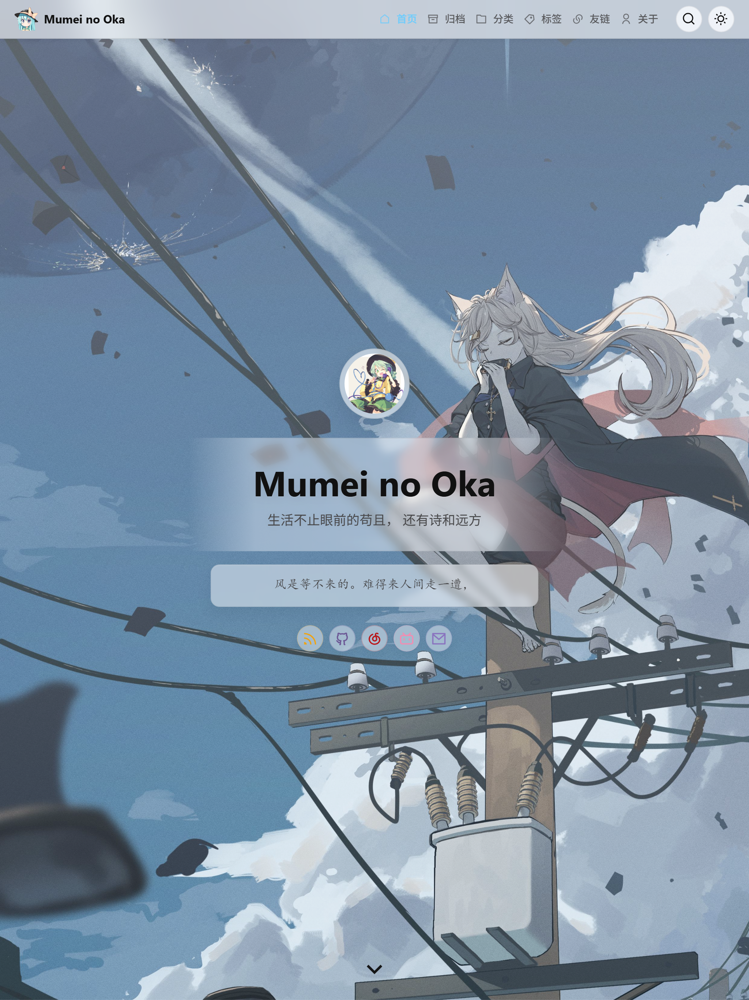
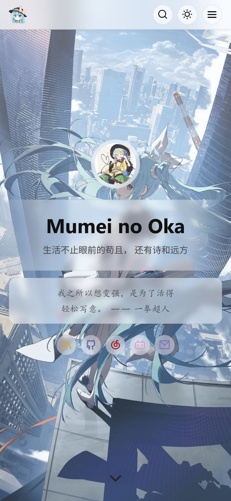

<h1 align="center">valaxy-theme-lolimeow</h1>

<pre align="center">一个轻二次元风格的 Valaxy 博客主题，适合安静地写日常、笔记与长文。</pre>

<p align="center">
  
</p>

<div align="center">
<table>
<tbody>
<tr>
<td align="center">
  <br>
  <span><b>简体中文 | <a href="./README.md">English</a></b></span><br>
  <sub>轻二次元氛围、柔和阅读平面、内置一言 Hero、本地搜索与有辨识度的聚合页。</sub><br>
  <sub><a href="https://lolimeow.yoyo514.top/">Live Demo</a> | <a href="https://lolimeow.yoyo514.top/docs/">文档</a></sub><br>
  
</td>
</tr>
</tbody>
</table>
</div>

## 预览

<div align="center">
<table>
<tbody>
<tr>
<td align="center" width="50%">
  <br>
  <sub><b>平板端</b></sub>
</td>
<td align="center" width="50%">
  <br>
  <sub><b>移动端</b></sub>
</td>
</tr>
</tbody>
</table>
</div>

## 快速开始

如果你是第一次使用 Valaxy，建议先阅读 [Valaxy 快速开始](https://valaxy.site/guide/getting-started)。

```bash
pnpm add valaxy-theme-lolimeow
```

```ts
import { defineValaxyConfig } from 'valaxy'

export default defineValaxyConfig({
  theme: 'lolimeow',
  themeConfig: {
    ui: {
      colors: {
        primary: '#66CCFF',
      },
    },
  },
})
```

## 主题特色

### 分层二次元氛围

- 全局背景与 Hero 背景分开解析，支持静态图、图片池与随机图片 API。
- 背景切换带有 preload / decode 处理，减少切图时的突兀感。
- 柔和阅读平面贯穿文章、卡片、footer 与聚合页，让插图氛围保留在内容背后。

### Hero 一言场景

- 支持固定文案、本地轮播文案，也支持使用内置的一言 API 模式。
- 一言来源可显示为 `句子 —— 来源`，并支持配置句子类型与长度过滤。
- Hero 头图、作者信息、社交链接、滚动提示组合成一个完整首屏场景。

### 轻柔阅读交互

- 导航栏会随阅读滚动自动隐藏，并对锚点跳转、分页滚动做联动保护。
- 移动抽屉支持 uneven / classic 两种风格。
- 猫头回顶按阅读进度填色，悬停时轻轻上浮；支持减少动态效果，手机端位于目录按钮上方。

### 本地搜索弹层

- 使用 Valaxy 生成的 Fuse 本地搜索数据。
- 搜索输入带防抖，支持键盘导航、加载态、空状态与错误态。
- 弹层视觉延续主题的柔和 surface，与抽屉、卡片和阅读面板保持一致。

### 聚合页

- 归档页使用时间线轨道，并在窄屏下切换为折叠形态。
- 分类页使用点击展开的树结构，适合分类逐渐变多后的浏览。
- 标签页使用 d3-cloud 生成紧凑词云，按文章数区分字号，支持点击与键盘筛选文章。
- 友链页支持前置 Markdown 说明、评论区，以及头像右下角的前端状态提示。

### 文章与评论

- 有图 / 无图文章头部保持一致的阅读节奏。
- Markdown 样式覆盖代码块、表格、媒体、脚注、容器和 Mermaid 示例。
- Waline 评论区已经按主题 surface 重新调整样式。

## 文档

README 只保留最小安装与主题概览。完整使用说明与按模块拆分的配置文档请阅读 [在线文档](https://lolimeow.yoyo514.top/docs/)。

开发时可参考：

- [theme/types/config.d.ts](./theme/types/config.d.ts)：查看主题配置结构。
- [theme/node/config.ts](./theme/node/config.ts)：查看默认值和兜底行为。
- [demo/valaxy.config.ts](./demo/valaxy.config.ts)：查看演示站配置。

## 插件

| 插件                                                                | 用途                             |
| ------------------------------------------------------------------- | -------------------------------- |
| [valaxy-addon-waline](https://github.com/walinejs/waline)           | 评论区                           |
| [valaxy-addon-mermaid](https://valaxy.site/addons/official/mermaid) | 可选图表，仅在使用图表的页面加载 |

使用 Valaxy `1.0.0-rc.16` 及以上版本时，Mermaid 需要单独安装 `valaxy-addon-mermaid`，并在站点 `addons` 中加入 `addonMermaid()`。详见 [插件接入说明](./docs/guide/comments-plugins.md#使用-mermaid)，已有 Mermaid 代码块无需修改。

## 开发

```bash
pnpm install
pnpm dev
```

```bash
pnpm demo
pnpm build
pnpm lint
pnpm typecheck
```

## 致谢

- [Valaxy](https://github.com/YunYouJun/valaxy)
- [Hitokoto](https://hitokoto.cn/)
- [Waline](https://github.com/walinejs/waline)

## License

[MIT License](./LICENSE) © Yoyo514
